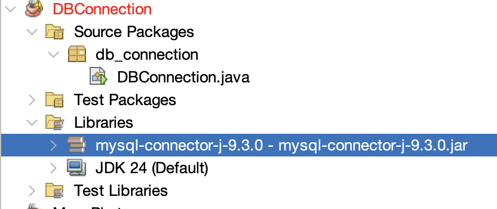

# DBConnection Java Project

Proyek ini adalah aplikasi Java sederhana menggunakan JDBC untuk terhubung ke database MySQL dan menampilkan data dari tabel `anggota` dalam database `rentalcd`.

---

## 🛠️ Teknologi yang Digunakan

* Java (dengan IDE **NetBeans**)
* MySQL Database
* MySQL Connector/J (`mysql-connector-j-9.3.0.jar`)
* XAMPP (untuk MySQL lokal)

---

## 📂 Struktur Proyek

```
DBConnection/
├── Source Packages/
│   └── db_connection/
│       └── DBConnection.java
├── Libraries/
│   ├── mysql-connector-j-9.3.0.jar
│   └── JDK 24 (Default)
├── db/
│   └── db.sql
```

---

## 📥 Cara Import Database ke MySQL (XAMPP)

1. Buka **XAMPP Control Panel**, nyalakan **Apache** dan **MySQL**.
2. Buka **phpMyAdmin** melalui browser: `http://localhost/phpmyadmin`.
3. Klik **New**, buat database baru dengan nama: `rentalcd`.
4. Klik database `rentalcd`, lalu buka tab **Import**.
5. Pilih file `db.sql` dari folder `db/db.sql`.
6. Klik **Go** untuk menyelesaikan proses import.

> Setelah selesai, tabel `anggota` akan berisi 3 data contoh.

---

## 🔗 Konfigurasi Koneksi Database

Koneksi database dilakukan pada file `DBConnection.java` dengan konfigurasi berikut:

```java
String url = "jdbc:mysql://localhost:3306/rentalcd";
String userid = "root";
String password = "";
```

Pastikan database `rentalcd` aktif dan nama tabel serta field sesuai.

---

## 📚 Menambahkan MySQL Connector ke NetBeans (dengan Gambar)

Agar proyek dapat menggunakan JDBC, Anda perlu menambahkan file `mysql-connector-j-9.3.0.jar` ke dalam Libraries proyek Java di NetBeans.

### Langkah-langkah:

1. **Unduh dan Ekstrak** file `mysql-connector-j-9.3.0.zip`.
2. Di **NetBeans**, klik kanan pada bagian **Libraries** dalam proyek.
3. Pilih **Add JAR/Folder**.
4. Arahkan ke lokasi file: `mysql-connector-j-9.3.0/mysql-connector-j-9.3.0.jar`.
5. Klik **Open** dan pastikan muncul di daftar Libraries.

### Tampilan di NetBeans:



---

## ✅ Output Program

Setelah dijalankan, program akan menampilkan isi tabel `anggota` seperti:

```
ISI TABEL anggota :
ID    Nama            Alamat                        Telp
--------------------------------------------------------------
A001  Tegar Saputra   Jl. Merdeka No.10, Yogyakarta 081234567890
A002  Dewi Lestari    Jl. Kenanga No.5, Sleman      082345678901
A003  Budi Santoso    Jl. Diponegoro No.22, Bantul  083456789012
```

---

## 👤 Author

* Nama: Ahmad Rizal
* Universitas: AKPRIND Indonesia
* Email: *\[tambahkan jika perlu]*

---

Selamat mencoba dan semoga berhasil! 🚀
